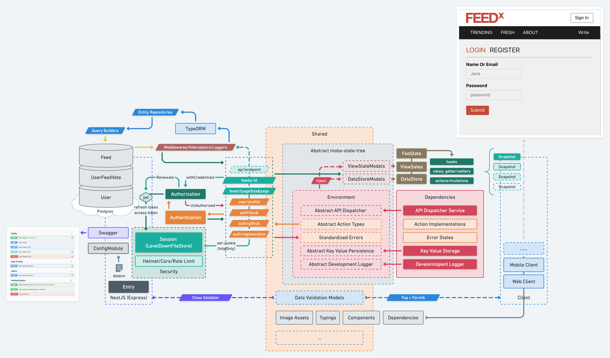

# FEEDx

Feed you with good ideas

# Setup

**Export DOTENV for yarnrc**

Under the project root, run `source scripts/export-dotenv` to export stuff from dotenv to global.

see why [here](./DEV_LOGS.md##yarnrc-dotenv)

**Install**

Run `yarn [install]` anywhere in the project.

## Directories

The project as a whole is a `workspace`, each entry defined in the root `package.json` is seen as a package.

```json
{
  "workspaces": ["shared", "web-client", "services"]
}
```

```
.
├── scripts
├── services // backend
├── web-client // web client
├── shared // shared stuff (say: validation schema)
└── package.json
```

# Overview

Here is the flow chart for an overview of the project structure on [whimsical](https://whimsical.com/feedx-the-flow-P2RcdBQufhHH4dAW7wakZ1):



## The state of the project

**🚨 Unfinished yet!**

Had too much time playing with details and here are lessons to learn:

1. Perfectionism hurts, for not finishing a `simple but made complicated by me` project within a 7-day .
2. Perfectionism helps, for there for sure are some deeper understandings on things.

**🙈 Still Safe for code review.**

**Backend**

- Username/email + password authentication
- session based jwt authorization with accessToken and refreshToken
- PITS:
  - NO BACKEND UNIT TEST

**Front-end**

- Simple auth pages ready
- PITS:
  - READY FOR API BUT MOBX HAS EMOTIONS ON ME.

## Backend Checklist

**Basics**

- [x] The API should follow typical RESTful API design pattern.

  Not every controller is fulfilled with actural responses, buth they must look the same as those already done codes.

- [x] Use any backend framework as you like. Use any DB for storing the data, or if you prefer, only using the memory \(with no permanent storage\) could just work.

  `NestJs` + `Postgres`

- [ ] Provide proper unit test.

  Currently, some of the `.spec.ts` files are auto generated by `@nest/cli`.

**Additional**

- [x] Provide a complete user auth \(authentication/authorization/etc\) strategy, such as OAuth.

  - Username + password authentication strategy
  - JWT based authorization strategy, tokens stored in backend session
  - Basic Security
  - Logout out

- [ ] Provide a complete logging \(when/how/etc\) strategy.

  Imported a `winston-logger`, no further implementations.

## Front-end Checklist

- [x] Make it responsive.

  - have an implementatin on `content-wrapper`'s width

- [x] Provide a form validation strategy.

  Uses `Yup` + `Formik` for form validation

- [ ] Provide an error handling strategy, such as the UI/UX, and different handling for different errors etc.

  - [x] Abstract and handle all api actions with `mobx-state-tree`.
  - [x] Use [Apisauce](https://github.com/infinitered/apisauce) for standardized errors, error state are also managed in `mobx-state-tree`.
  - [ ] A mobx state for the errors, and an UI adapter for the errors, like a `dialog box`?

- [x] The frontend part should be a single page application rendered in the frontend and load data from a RESTful API \(not rendered from backend\).
- [x] Use React for the frontend.
- [ ] Do not use any scaffolding tool such as `create-react-app`, or any CSS framework, but try to use some JS frameworks such as React-Router, and packing tools such as Webpack or Parcel etc.

  Rather than starting from building a webpack-dev-server, which may be time consuming (havent't been dealing with bare setup for long), **My cheat process**:

  - [x] Started the front-end with `create-react-app`,

  - [x] `npm eject` the app,

  - [ ] Delete anything of redundancy

## Next

- Write unit tests.
- Use styled components and storybook (optional).
- Deploy it on `vercel`.
