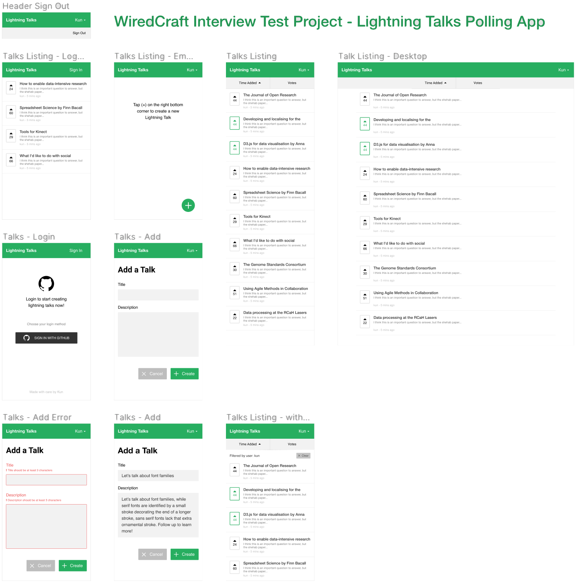

# Lightning Talks Polling App

## Wireframe & Design

Checkout [lightning-talks-polling.fig](https://github.com/rankun203/test-fullstack/blob/master/docs/lightning-talks-polling.fig), use Figma to open it. Or use [this view only link](https://www.figma.com/file/yFqtpELaUl31Qe0GGXTsXR/Lightning-Talks-Polling).

This app was designed in a Mobile First approach.

<p align="center"><a href="https://www.figma.com/file/yFqtpELaUl31Qe0GGXTsXR/Lightning-Talks-Polling"></a></p>

## API

API Documentation: [open-api.yaml](https://github.com/rankun203/test-fullstack/blob/master/docs/open-api.yaml), or use [this view only link](https://documenter.getpostman.com/view/4228/SW7c2n5Z).

## Run This Project

### Configuration

Edit .env as well as server/.env:

```bash
# Configure frontend
cp .env.sample .env

# Configure backend
cd server
cp .env.sample .env
```

Mind that you will need to specify `API_SERVER` for frontend and `FRONTEND_BASE_URL` for backend.

You can build the project locally and run it, or you can use the pre-built docker images to run.

### Pre-built Docker Image

```bash
npm run start:docker
# Then navigate to http://localhost:8000 in your browser
```

### Build

```bash
npm run start
# Then navigate to http://localhost:1234 in your browser
```

## Containerization

This project includes `Dockerfile`s for each sub-project (client, server), and have a `docker-compose.yml` which you can use to quickly spin up an instance.

## Deployment

For deployment, I'm using [this tool(reverse-proxy)](https://github.com/rankun203/reverse-proxy) I created to put it online.

## Tech Stack

### Form Validation

For form data validation, I'm using [Yup](https://github.com/jquense/yup) as the schema validator, it works on both frontend and backend, compares to Joi, it's lighter and generally more friendly to use in browsers, and it supports backend as well, and it supports multiple languages.

In addition to that, I'm using [Formik](https://jaredpalmer.com/formik) to manage my form state and validates against schemas.

### Error Handling

Server side: Heavily influenced by this repo [Wiredcraft/service-error](https://github.com/Wiredcraft/service-error). it's what I considered a good practice. Extend from ExtendableError is easier to work with than extending from Error itself.

### ID Generation

Use [cuid](https://github.com/ericelliott/cuid)(by ericelliott) instead of uuid/v1 or uuid/v4. UUID is like USB Type-C connector, the shape looks the same but the implementation can be vastly different. cuid offers the same functionality as uuid/v1, so for this particular project I'll just use cuid for better recognizability.

Similar to MongoDB's Object ID, it also breaks down into different parts which is faster for binary search since some parts in the front won't change that often.

The implementation of ID generation can be easily swapped, checkout [server/src/utils/id.js](https://github.com/rankun203/test-fullstack/blob/master/server/src/utils/id.js).

### Database

Using Redis as the only database, it works great for current requirement, but it's not so easy to work in the future. I haven't defined any database migration logic yet.

### Authentication

Using Github as OAuth provider, since it doesn't support implicit grant yet, I'm implementing OAuth web application flow instead.

- When a user login with GitHub, the api server will redirect the user to Github's authorize page
- Then redirect back to api server with the `authorization code`
- Then api server will try to obtain `access_token` for this user with that authorization code
- Then api server will use the access token to get user's profile, which contains a login(username), and use that login as username in our system.
- The api server then generates a new access token(jwt) for the user, the user will need to use this token for future requests
- Till now, the only step which is missing is to pass that access token back to client side
  - Method 1 [Selected]: Redirect to frontend app with access token in the URL query parameter, this is similar to implicit grant, which has its own security issue
  - Method 2: Use session (not ideal, since it's not stateless).

### Frontend Overall Architecture

Using React Hooks in conjunction with useReducer(), useContext() to manage application state.

### Backend Overall Architecture

Applying practices of [Uncle Bob's clean architecture](https://blog.cleancoder.com/uncle-bob/2012/08/13/the-clean-architecture.html), but due to limited time I have to design the API system, the implementation is not so "clean" after all(e.g., db part) and should be considered twice if it's gonna be used in production in large scale.

It looks like Dependency Injection in a way, under each layer(folder), there is an [index.js](https://github.com/rankun203/test-fullstack/blob/master/server/src/modules/talks/models/index.js) to configure the dependencies for other functions in the same layer.

The benefits: Separation of concern and high flexibility for changing implementation of each layer, for example if we want to add another talks db layer, we can just add it in `data-access` layer and configure it under `services` layer's index.js file.

The drawback is there are much more boilerplate code, just to take care of different layers of a simple create talk action, it takes hundreds lines of code compares to tens of lines if we just want something quick.

### JavaScript Code Style

On top of some of the best practices, here are a few opinionated JavaScript code style used in this project:

- Use named exports over default exports
- Normal functions and arrow functions both can be used, `function` keyword for easier naming and arrow functions for easier management of `this` scope.
